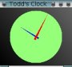
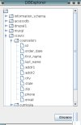
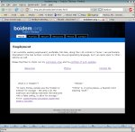

   *This page is long unmaintained. You might do better at [github](https://github.com/toddfoster) .**

These are a few of my projects and random experiments from over the years. I enjoy experimenting with new languages and coding up short-cuts for common tasks.

This list is presently and forever incomplete.

# Projects:

* [Adless Calc](http://www.boidem.org/adlessCalc) ([git](https://github.com/toddfoster/adlessCalc))
* Python
   * [SimpleNoteCat](https://github.com/toddfoster/sncat)
* Java
   * Analog Clock ( source "class":portfolio/AClock/AClock.class ) (see below)
   * BabyGame.jar (see below)
   * DBExplorer (see below)
   * MagnifyingGlass ("jar":portfolio/MagnifyingGlass.jar) -- A system tray icon that changes in response to the build status of the project I'm working on. Hard coded to function with [Anthill](http://www.anthillpro.com), the build server used by my employer.
* Ruby
   * pt (see below)
   * ip2a : iPhoto to [album](http://marginalhacks.com/Hacks/album/) converter. Takes iPhoto library and creates a directory hierarchy for album which maintains basic album structure, titles and commments. Use at your own risk: it worked for me!
* Bash
   * md2pdf (markdown to pdf converter)
* Perl
   * genmen (menu generator for SmartMenu & Lirc)
* PHP
   * curricula -- A web page built for a friend to allow scout masters to request curricula for different merit badges. It was an ugly time in my life: read the source at your own risk!
* HTML/Javascript
   * "SVG Drawing":portfolio/draw.html
   * A thought-experiment to toy with jquery and a javascript markdown library to create an ultra-simple wiki
   * [DigitalBCP](http://www.digitalbcp.org)
* Open Source
   * Contributed theme for [album](http://marginalhacks.com/Hacks/album/.) (Perl, Javascript and html/css)
      * A second, more interesting theme
   * Patch accepted into [pcal](http://pcal.sourceforge.net/) (C and Postscript).
      * My patch has since been upgraded to a primary command-line switch (-W)!
   * Contributed equations to automate changes to [David Seah's](http://davidseah.com/page/compact-calendar) Compact Calendar
   * Two games, a library and some developer documentation for [PandoraPanic](http://projectinfinity.org.uk/doku.php?id=homebrew:games:pandorapanic.) (C++)
   * Minor bug fix to [mono](https://github.com/mono/mono/commits/master?author=todd.foster@logos.com), the open source implementation of Microsoft's .NET CLR.
   * Minor patch accepted into [flac2ogg](https://github.com/adisbladis/flac2ogg/pull/1) to optionally avoid overwriting files already processed.

----------

## Analog Clock

This was one of my first little projects in Java. The world didn't need another `oclock`, but I made it anyway. It was a fun introduction to Java's graphical elements.

There's one hidden "feature": if you pass the command line argument "test," the hands will move quickly in order to demonstrate their functionality.  I wanted to test how it was going to work without watching it for 12 hours.

If you check out the source you may notice that I crammed everything into [a single class file](portfolio/AClock/AClock.class). I did this to make it easy to share this program without having to mess with learning how to creating a jar (one thing at a time!).

## Baby Game

So I stumbled across a program called [Baby Banger](http://goodeast.com.)  My kids enjoyed playing with it. But it only runs on the Mac. Right now, in the midst of our transition to Texas and search for work, the Mac is packed away in storage. So what to do? It sounded like a perfect second project for my nascent Java skills.

The source is included in the "jar file":portfolio/BabyGame.jar.

## DBExplorer

I had an interview with a small company in San Antonio. They wanted someone to help them transition their legacy DB system (including GUI) to something more standard and current: MySQL + PHP for reporting and Java for POS.  Great! At that point I had never touched MySQL and hadn't done much beyond the clock (above) in Java. So after the interview, I bought a book on MySQL, built a PHP application for a friend, and got to work on this project: DBExplorer.

DBExplorer has two screens. The first asks for a username, password and URL to a database. It also asks one to select a protocol for connecting to the DB, but the only protocol presently available is MySQL.

Then, for the second screen, the program connects to the DB, finds out everything it can about the structure of the contents of that DB, and displays a nice tree of databases, tables and fields.

The source is included in the "jar file":portfolio/DBExplorer.jar.

## pt (Page Template)

 This is the the script I originally used to build this website. I took a page template produced for me by Amy Warren[1] and meshed it into a ruby script. The script can use as input files containing html, php, rhtml, ruby, perl, or plain text (interpreted using markdown). These files would be inserted into the templates to make the final website.

Apparently I wasn't the only person with this idea. It has been generalized and extended in an excellent project called [Jekyll](http://github.com/mojombo/jekyll/.) Jekyll is natively supported on github, which makes for a very convenient and well-priced web-host.

fn1. Design goodness credit for this website goes to [Amy](http://amywarrencreative.com.) Design badness credit goes to me for distorting her original design!

source
